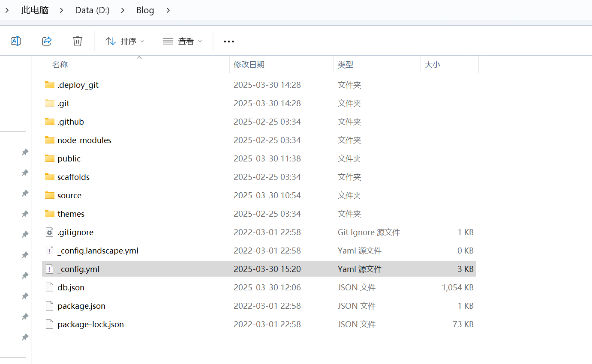
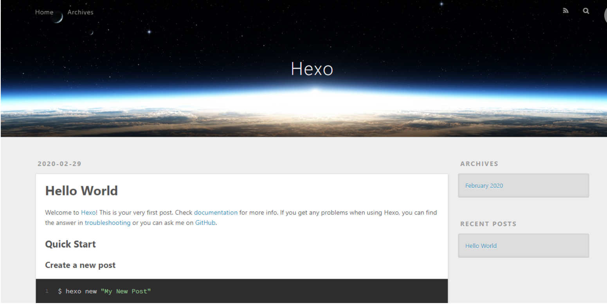
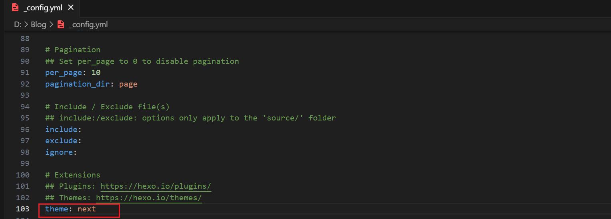
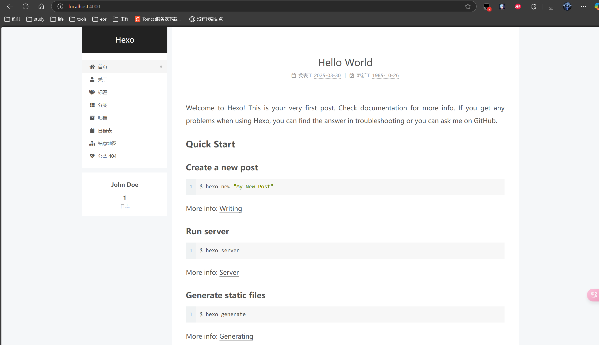
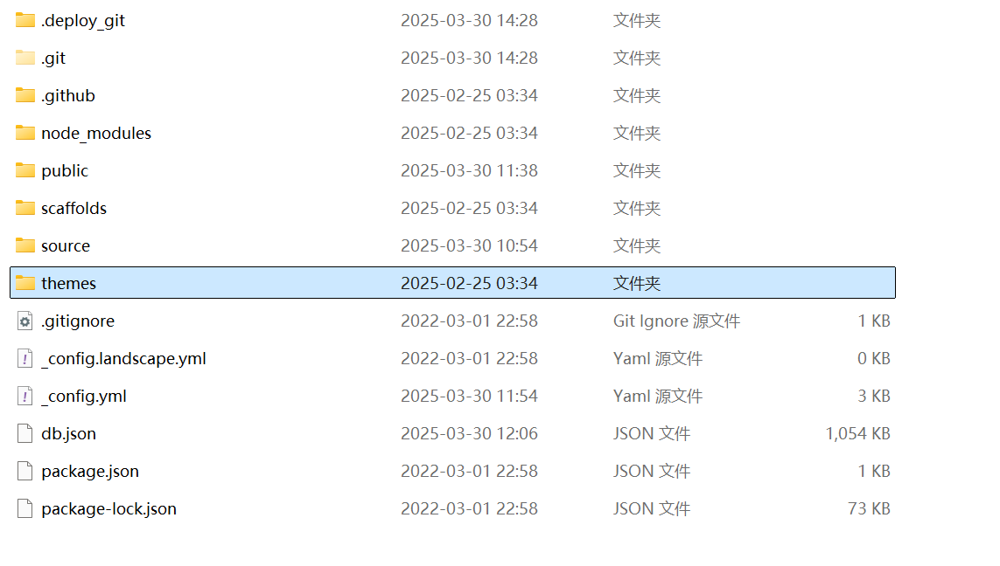
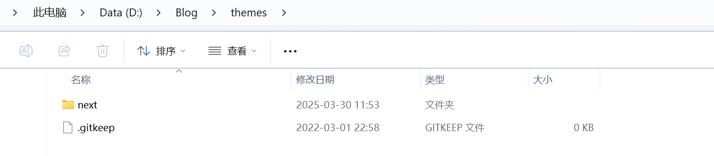
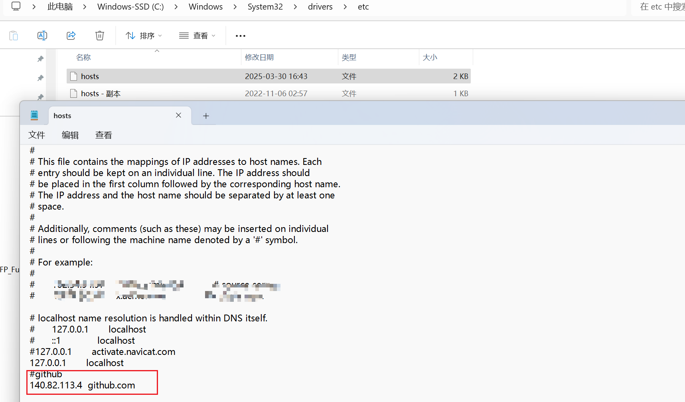

# 1. 环境准备

在开始使用 Hexo 之前，需要安装以下软件：

- **Node.js**：Hexo 是基于 Node.js 开发的，所以需要先安装 Node.js。你可以从 [Node.js 官方网站](https://nodejs.org/) 下载适合你操作系统的版本进行安装。安装完成后，在命令行中输入 `node -v` 和 `npm -v` 来验证安装是否成功，如果能显示出版本号，说明安装成功。

- **Git**：用于将本地博客项目部署到远程仓库，如 GitHub。可以从 [Git 官方网站](https://git-scm.com/) 下载并安装。安装完成后，在命令行中输入 `git --version` 验证安装情况。

- **cnpm**:是 [淘宝NPM镜像](https://npmmirror.com/) 提供的包管理工具，用于解决国内直接使用`npm`下载依赖速度较慢的问题，功能与`npm`基本一致，可通过国内镜像源提升包的下载效率。

  ```bash
  npm install -g cnpm --registry=https://registry.npm.taobao.org
  ```

  

# 2. 安装 Hexo

打开命令行工具，执行以下命令全局安装 Hexo：

```markdown
npm install -g hexo-cli
```

安装完成后，输入 `hexo -v` 验证安装是否成功。

要提交到远程仓库需要执行以下命令

```
npm install hexo-deployer-git --save
```


# 3. 初始化博客项目

在你想要创建博客的目录下，执行以下命令初始化 Hexo 项目：

```markdown
hexo init D:\Blog #D:\Blog就是后续博客的根目录，可根据实际情况
cd D:\Blog
npm install
```

上述命令会在D盘下创建一个名为 `Blog` 的文件夹，并初始化 Hexo 项目，同时安装所需的依赖。


# 4. 项目目录结构

初始化完成后，项目的基本目录结构如下：




```markdown
Blog/
├── .deploy_git/       # 部署相关的Git文件夹
├── .git/              # Git版本控制文件夹
├── .github/           # GitHub相关配置文件夹
├── node_modules/      # 项目依赖包文件夹
├── public/            # Hexo生成的静态文件文件夹
├── scaffolds/         # 模板文件夹
├── source/            # 博客文章的源文件
|   ├── _drafts/      # 草稿文章
|   └── _posts/       # 正式发布的文章
│   └── categories/   # 分类 
│   └── tags/         # 标签
├── themes/           # 主题文件夹
│   ├── next/         # 主题的名称
├── .gitignore         # Git忽略规则配置文件
├── _config.landscape.yml  # landscape主题的配置文件
├── _config.yml        # 博客的全局配置文件
├── db.json            # Hexo的数据库文件
├── package.json       # 项目依赖信息文件
└── package-lock.json  # 依赖包版本锁定文件
```

若初始目录结构中的`source`文件夹下无`tags`文件夹，可输出入以下命令；` categories`同理。

```java
hexo new page "tags"
```


# 5. 生成静态文件

在命令行中执行以下命令将 Markdown 文件生成静态 HTML 文件：

```markdown
hexo generate
```

或简写

```
hexo g
```

每次更改md文件后,都要执行一次命令来更新html文件。

# 6. 本地预览

执行以下命令启动本地服务器，预览博客效果：

```
hexo server
```

或简写

```
hexo s
```

在浏览器输入以下地址浏览：

```
http://localhost:4000 
```



# 7.提交到远程仓库

```
hexo d
```

或简写

```
hexo d
```

# 8.切换主题

hexo的所有主题都在下面这个地址：

```java
https://hexo.io/themes/
```


选好主题后，就得先把主题弄到本地来，可以使用`git clone`命令进行下载(具体参考每个主题仓库的`README`文档)，也有一种粗暴的方法，直接下载压缩包，然后解压到`themes`文件夹就可以了

克隆命令:`git clone 复制的地址 themes/主题名字`,以next为例：

```bash
git clone https://github.com/theme-next/hexo-theme-next.git themes/next
```


在`_config.yml`中的`theme`选择主题。注意：是博客根目录下的`_config.yml`

- 站点配置文件

  指的是博客根目录下的`_config.yml`

- 主题配置文件

  指的是某个主题下的`_config.yml`

注意：它们的名字都叫`_config.yml`但是不能弄混淆





重新执行生成命令`hexo g`后，再启动本地预览`hexo s`，主题就变了




打开你的博客文件夹，会发现有一个`themes`文件夹，这就是存放网站主题的文件夹



打开文件夹，你就能看到现在能用的主题有哪几个，文件夹名就是主题名。我这里只有一个主题




# 9.hexo-github的编辑与上传

在博客根目录下面执行：

```java
hexo new "博客文章名称"
```

本地预览：

```java
hexo s
```

上传至远程github仓库：

```java
hexo g -d
```


# 10.解决`hexo d`异常

**C:\Users\Administrator.ssh 中找到.ssh文件夹（此前配置SSH时会生成该文件夹）**

在 .ssh 文件夹中新建文本文件 config ,不带后缀（可以新建文本文档，去掉 .txt 后缀）
打开 config 文件，输入以下内容，保存后即可，其中[xxx@qq.com](mailto:xxx@qq.com) 为你自己的邮箱

```tex
Host github.com
User xxx@qq.com
Hostname ssh.github.com
PreferredAuthentications publickey
IdentityFile ~/.ssh/id_rsa
Port 443
```


**修改hosts文件**

操作系统中 hosts 文件的权限优先级高于DNS服务器，在 `C:\Windows\System32\drivers\etc` 目录下找到并修改 `hosts` 文件，增加一条 github.com 的域名映射可以解决。




最后，输入 `hexo d` 就能够上传部署成功了！


# 11.测试 SSH 连接到 GitHub

```bash
ssh -vT git@github.com
```

- 首次连接会提示「Are you sure you want to continue connecting (yes/no)?」，输入`yes`回车
- 若出现提示 `Hi <你的GitHub用户名>! You've successfully authenticated, but GitHub does not provide shell access.`，说明 SSH 配置成功


参照:[hexo+github小白教程](https://www.cnblogs.com/huanhao/p/hexobase.html)
