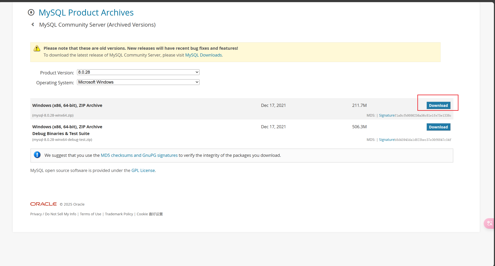
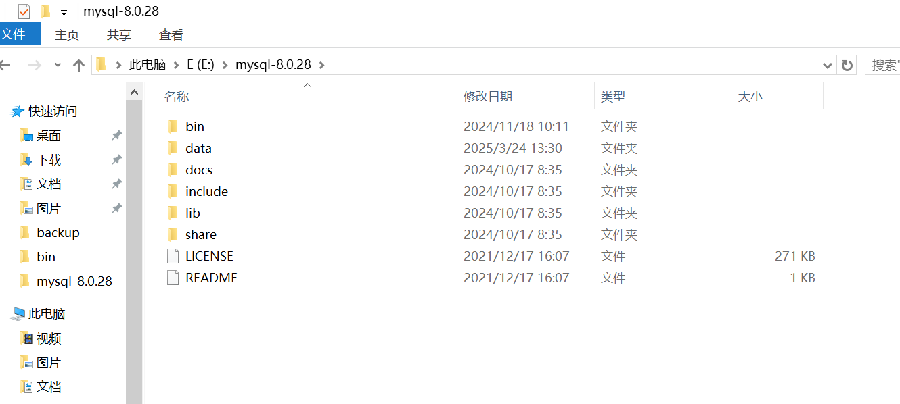
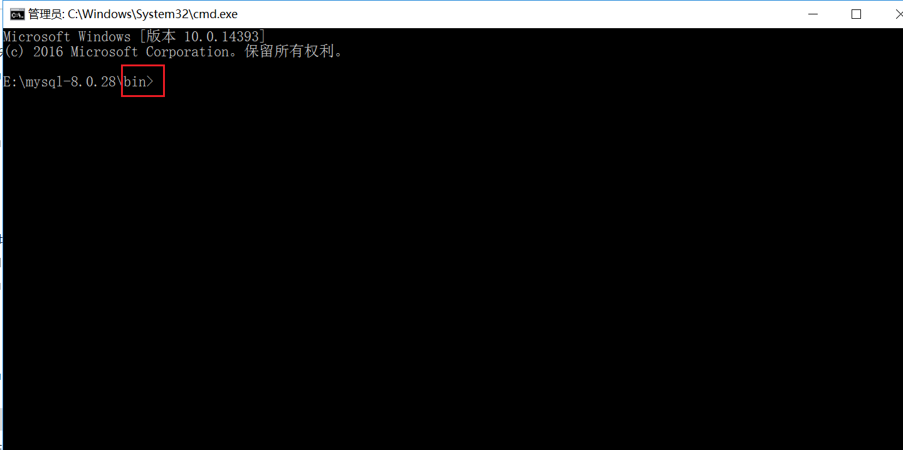
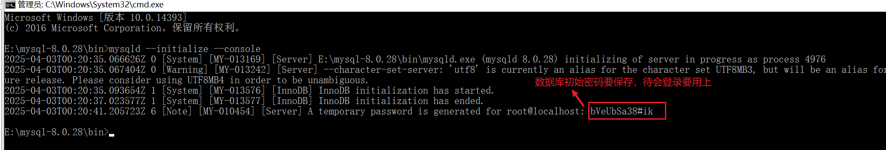

# 下载MySQL免安装压缩包

下载地址:https://downloads.mysql.com/archives/community/




# 解压安装

+ 接下来我们解压文件夹，这时我们解压的文件夹是没有my.ini文件和data目录，这时我们需要自己创建my.ini文件,data文件后期回自动生成。

  

+ 新建配置my.ini文件，并添加配置信息，如下：

  ```tex
  [Client]
  #设置3306端口
  port = 3306
   
  [mysqld]
  bind-address=0.0.0.0
  #设置3306端口
  port = 3306
  # 设置mysql的安装目录
  basedir=E:\mysql-8.0.28
  # 设置mysql数据库的数据的存放目录
  datadir=E:\mysql-8.0.28\data
  # 允许最大连接数
  max_connections=200
  # 服务端使用的字符集默认为8比特编码的latin1字符集
  character-set-server=utf8
  # 创建新表时将使用的默认存储引擎
  default-storage-engine=INNODB
  early-plugin-load=""
  skip-grant-tables
   
  [mysql]
  # 设置mysql客户端默认字符集
  default-character-set=utf8
  ```

  **注意：**下面两个路径改为自己的路径

  设置mysql的安装目录:`basedir=E:\mysql-8.0.28` #

  设置mysql数据库的数据的存放目录:`datadir=E:\mysql-8.0.28\data`

  

+ 以”管理员身份”运行命令提示符cmd，进入安装解压的mysql的bin目录下:
  

# 初始化服务

+ 执行命令保存一下初始密码：

  `mysqld --initialize --console`
  
  
  **注意：**若之前安装过MySQL，则data文件夹是有文件的。此时输入上述命令会报错，因此需要把data文件夹的内容都删除或直接删除data文件夹。

+ 安装服务

  `mysqld --install [服务名]`
  注意:`mysqld --remove [服务名]` 为删除服务
    

+ 更改密码

  先输入`mysql -u root -p`

  然后将刚才保存的密码输入登录进入mysql

  ```
  alter user 'root'@'localhost' identified by 'youpassword';
  ```

  `youpassword`是你要修改的密码

# 扩展

允许外部链接数据库:`update user set host ='%' where user ='root' and host = 'localhost';`

刷新权限:`FLUSH PRIVILEGES;`

数据库授权:`GRANT ALL PRIVILEGES ON . TO ‘root’@’%’ IDENTIFIED BY ‘123456’ WITH GRANT OPTION;`

# 参考

 [mysql8免安装版安装配置教程](https://www.cnblogs.com/matts-my/articles/18000380)

 [Mysql 5.7 免安装版windows安装完整教程](https://www.cnblogs.com/lhboke/p/18289027)

 [Navicat无法连接mysql](https://cloud.tencent.com/developer/article/2109715?from=15425)