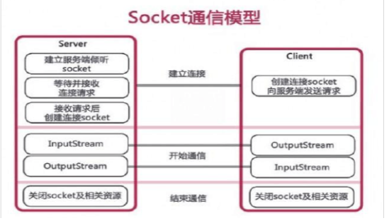

Java Socket 可实现客户端--服务器间的双向实时通信。包中定义的两个类socket和ServerSocket，分别用来实现双向连接的client和server端。



# Socket 通信实现方法

## 2.1（非多线程）

### 服务器端

1.用指定的端口实例化一个SeverSocket对象。服务器就可以用这个端口监听从客

户端发来的连接请求。

2.调用ServerSocket的accept()方法，以在等待连接期间造成阻塞，监听连接从

端口上发来的连接请求。

3.利用accept方法返回的客户端的Socket对象，进行读写IO的操作

4.关闭打开的流和Socket对象

```java
/**

* 基于TCP协议的Socket通信，实现用户登录，服务端

*/

//1、创建一个服务器端Socket，即ServerSocket，指定绑定的端口，并监听此端口

ServerSocket serverSocket =newServerSocket(10086);//1024-65535的某个端口

//2、调用accept()方法开始监听，等待客户端的连接
Socket socket = serverSocket.accept();

//3、获取输入流，并读取客户端信息

InputStream is = socket.getInputStream();

InputStreamReader isr =newInputStreamReader(is);

BufferedReader br =newBufferedReader(isr);

String info =null;

while((info=br.readLine())!=null){

System.out.println("Hello,我是服务器，客户端说："+info)；

}

socket.shutdownInput();//关闭输入流

//4、获取输出流，响应客户端的请求

OutputStream os = socket.getOutputStream();

PrintWriter pw = new PrintWriter(os);

pw.write("Hello World！");

pw.flush();

//5、关闭资源

pw.close();

os.close();

br.close();

isr.close();

is.close();

socket.close();

serverSocket.close();
```

### 客户端

1.用服务器的IP地址和端口号实例化Socket对象。

2.调用connect方法，连接到服务器上。

3.获得Socket上的流，把流封装进BufferedReader/PrintWriter的实例，

以进行读写

4.利用Socket提供的getInputStream和getOutputStream方法，通过IO

流对象，向服务器发送数据流

5.关闭打开的流和Socket。

```java
//1、创建客户端Socket，指定服务器地址和端口

Socket socket =newSocket("127.0.0.1",10086);

//2、获取输出流，向服务器端发送信息

OutputStream os = socket.getOutputStream();//字节输出流

PrintWriter pw =newPrintWriter(os);//将输出流包装成打印流

pw.write("用户名：admin；密码：admin");

pw.flush();
socket.shutdownOutput();

//3、获取输入流，并读取服务器端的响应信息

InputStream is = socket.getInputStream();

BufferedReader br = new BufferedReader(new InputStreamReader(is)); String info = null;

while((info=br.readLine())!null){

System.out.println("Hello,我是客户端，服务器说："+info);

}

//4、关闭资源

br.close();

is.close();

pw.close();

os.close();

socket.close();
```

## 2.2 服务器端（多线程）

1.服务器端创建ServerSocket，循环调用accept()等待客户端连接

2.客户端创建一个socket并请求和服务器端连接

3.服务器端接受客户端请求，创建socket与该客户建立专线连接

4.建立连接的两个socket在一个单独的线程上对话

5.服务器端继续等待新的连接

```java
//服务器线程处理和本线程相关的socket

Socket socket =null;

public serverThread(Socket socket){

this.socket = socket;

}

ServerSocket serverSocket =newServerSocket(10086);

Socket socket =null;

int count =0;//记录客户端的数量

while(true){

socket = serverScoket.accept();

ServerThread serverThread =newServerThread(socket); serverThread.start();

count++;

System.out.println("客户端连接的数量："+count);

}
```

