# 正则表达式

**==正则表达式以“^”开头，“$”结尾==** 

- **字符集：**

| [1234]                     | 1,2,3,4之一                                 |
| :------------------------- | :------------------------------------------ |
| **[^12]**                  | **除了1，2**                                |
| **[1-5]**                  | **1,2,3,4,5**                               |
| **[a-f]**                  | **a-f之间**                                 |
| **[0-9a-fA-F]**            | **一个 16 进制字符**                        |
| **0[xX]\[0-9a-fA-F]{1,8}** | **表示整数的 16 进制数表达式**              |
| **[\w-]{8,15}**            | **表示 8-15 个人以字符、下划线、数字及“-”** |

- **预定义字符集:**

| \d        | 表示[0-9]                                       |
| --------- | ----------------------------------------------- |
| **\w**    | **表示单词字符 [0-9a-zA-Z_] 注：包含下划线“_”** |
| **\s**    | **表示匹配空白: \t \n \r \b \p**                |
| **.**     | **任意字符**                                    |
| **\D**    | **(不常用)表示非数字**                          |
| **\W**    | **(不常用)表示非单词字符 [0-9a-zA-Z_]**         |
| **\S**    | **(不常用)表示非空白**                          |
| **{n}**   | **表示数词 n 个，比如表示“5 个以上”用{5，}**    |
| **{m,n}** | **表示数词 m 到 n 个**                          |
| **?**     | **表示能出现 0 到 1 次 {0，1}**                 |
| **+**     | **表示能出现 1 到 n 次 {1，}**                  |
| *****     | **表示能出现 0 到 n 次 {0，}**                  |

- **常用正则表达式写法**

 ** 邮政编码                                 ^[0-9\][0-9\][0-9\][0-9\][0-9][0-9\]$** 

​                                                  【解释】0-9 的任意数字可出现 6 次 

​                                                   ^[0-9]{6}$ 

​                                                  【解释】0-9 的任意数字可出现 6 次 

​                                                 ^\d{6}$ 【解释】0-9 的任意数字可出现 6 次 


** 用户名规则                           ^\w{8,10}$** 

​                                                【解释】可出现 8-10 个单词戒字符


​                                                    +86 13912345678 

** 电话号码                              ^(\+86|0086)?\s?\d{11}$** 

​                                                 【解释】 "+"特殊字符，需要转义"\+"表示"加号" 

​                                                 \+86                      表示出现"\+86"这几个字符 

​                                                 (\+86|0086)?       表示"+86"戒"0086"出现 0-1 次 

​                                                 \s?                        表示空白(空格)出现 0-1 次

​                                                  \d{11}                 表示出现 11 位数字


** 身份证号码**                                **^\d{15}(\d{2}[0-9xX])?$**


** 一个点的坐标                        ^\d+(,\s*|\s+)\d+$** 

​                                               【解释】 \d+               表示出现 1 个及以上的数字

​                                                              (,\s*|\s+)      表示出现“逗号和 0 个及以上的空 白”戒“1 个以上的空白

​                                                             \d+                表示出现 1 个及以上的数字


​                                                    2011-01-30

** 日期                                         ^\d{4}-\d{2}-\d{2}$** 

​                                                    **^\d{4}(-\d{2}){2}$**


​                                               192.168.0.2 

** IP 地址                              ^\d{1,3}\.\d{1,3}\.\d{1,3}\.\d{1,3}$**

​                                              **^\d{1,3}(\.\d{1,3}){3}$ ^(\d{1,3}\.){3}\d{1,3}$**     “.”是特殊字符，需要转义“\.”


# 集合框架（Collection 和 Map） 

集合框架包括集合不映射（Collection and Map）, 以及它们的子类（容器类）

+ **List** 元素有先后次序的集合, 元素有 index 位置, 元素可以重复，继承自 Collection 接口
  - 实现类: ArrayList, Vector, LinkedList
+ **Set** 元素无续,不能重复添加, 是数学意义上的集合, 继承自 Collection 接口 
  - 实现类: HashSet(是一个只有 Key 的 HashMap)
+ **Collection** 集概念, 没有说明元素是否重复和有序, 使用集合的跟接口, 很少直接使用 其他集合都是实现类: ArrayList, HashSet
+ **Map** 描述了（key： value）成对放置的集合，key 不重复，Value 可以重复（key 重复算一 个）
  -  实现类: HashMap(散列表算法实现)
  -  TreeMap(二叉排序树实现,利用 Key 排序) 
  -  Map 适合检查查找

集合（Collection）框架，掌握常用的 3 个即可，如下图所示：

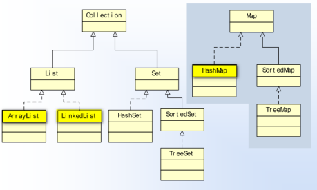

**Collection** 接口              表示集合的概念

 List 接口 

Set 接口

**List 接口**                          表示有序线性表的概念

ArrayList                                  底层实现是数组 

LinkedList                                底层实现是链表

**Set 接口**                           表示无序不重复的概念 

HashSet

# Java 泛型

**泛型**是 Java5 以后提出的语法现象，作用是在**编译期**检查的类型约束（运行期不检查泛型） 泛型可以用来约束类中元素的类型

# 集合的迭代 

## 集合的迭代，是一种遍历算法。

1) 迭代操作举例：播放列表的“逐个播放”；将扑克牌“逐一发放”

2) java 使用 Iterator 接口描述了迭代模式操作 

   Iterator 中的方法，与门为 **while 循环设计**

3) Iterator 的实例可以从**集合对象**获得，是这个集合的一个元素序列视图，默认包含一个**操作游标**（在第一个元素之前）

   **hasNext()**方法，可以检查游标是否有下一个元素

   **next()** 方法，移动游标到下一个元素，并丏返回这个元素引用 使用 **while 循环**配合这个两个方法, 可以迭代处理集合的所有元素 

4) 迭代时可以使用迭代器 remove() 方法删除刚刚迭代的元素在迭代过程中

   **迭代时不能使用集合方法**(add, remove, set) 更改集合元素

### 案例：Iterator

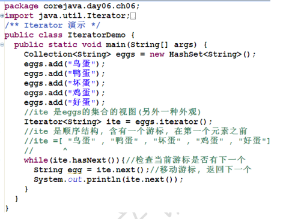

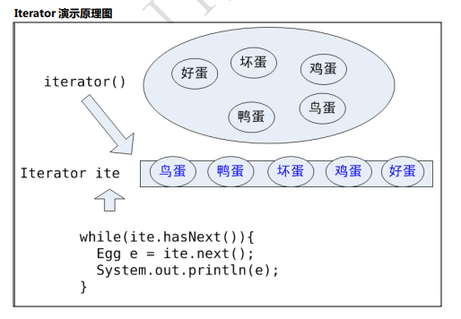

## 集合的工具类 Collections

同数组的工具类 Arrays 相同，集合的工具类为 Collections，其中提供了许多的方法，诸如排序、 二分查找、打乱、填充等操作。

### 案例：Collections

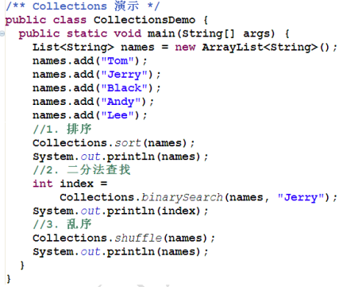

Collections.sort()底层调用了 str.compareTo()方法比较大小

# 集合补遗

## 集合复制

**集合复制**，Java 默认的复制规则是浅表(浅层)复制

集合复制有 2 种方式：

1) clone() 方法  clone()方法是 Object 定义的 
2)  使用"复制构造器"

+ Map map = new HashMap();

​       Map map2 = new HashMap(map);

+ List list1 = new ArrayList(); 

​       List list2 = new LinkedList(list1);

浅表复制_clone()方法

浅表复制_"复制构造器"

## 同步化（线程安全）

同步化解决方案：

1) Collections.synchronizedList()方法可以将非线程安全的list 包装为线程安全的 

+ List list = new ArrayList();

​       list = Collections.synchronizedList(list); //转换以后就相当于 Vector

1)  Collections.synchronizedMap()方法可以将非线程安全的 map 包装为线程安全的 

+ HashMap map = new HashMap(); 

​       map = Collections.synchronizedMap(map);

## 数组与集合的转换

数组转 List

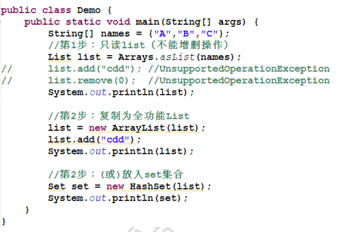

集合转数组

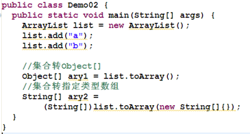

## Collection 与 Collections

面试可能会遇到的题目，Collection 和 Collections 的区别是什么？

- Collection 抽象的集合概念，实现它的有 List 和 Set 

- Collections 集合静态工具类, 包含集合的工具方法，如 sort()等

## Map 的迭代

- 对 key:value 进行迭代 map.entrySet(); 

- 对 key 进行迭代 map.keySet(); 

- 对 value 进行迭代 map.values();

# 时间日期

+ Java 中的时间类有：Date 和 Calendar
+ Java 中时间类的本质
  - Date = long + 操作
  - Calendar = long + 操作
+ 时间的标准有两种
  - （1970）GMT long
  - （0）UTC long

## 日期的输入与输出 

+ 日期输出的本质是将 Date 转换为格式化的 String

+ 日期输入的本质是将格式化的 String 转换为 Date

  - java.text.SimpleDateFormat fmt = new SimpleDateFormat("yyyy-MM-dd");

  - fmt.parse(String)可以实现将(合法)字符串解析为日期类型, 经常用于处理日期输入

    fmt.format(Date)可以把日期格式化为字符串用于输出处理

# 异常（Exception）

1) 什么是异常？ 异常是行为（方法、过程）的意外结果 

2) 一个方法如果抛出了异常，这个方法就必须声明异常的抛出 

3) 异常的声明：在方法上声明方法的意外结果 如：

   - User reg( String pwd, String email) throws UserExistException; 

   - User login(String email, String pwd) throws NameOrPwdException; 

4) 异常类一般继承于 Exception 

5) 调用抛出异常的方法，必须处理异常，有两种方式

   + 使用 try catch finally 捕获
   + 直接再抛出异常

​        处理异常的方式依赖于具体业务逻辑，可灵活处理

2) 如果代码有异常发生，异常以后的代码将不再执行

## 异常的分类

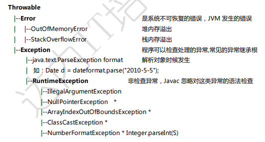

关于异常的分类：

1) Error 是 JVM（Java 虚拟机）中出现的不可恢复的错误

2) Exception 是类（Class）发生的异常 

   + 检查异常                编译期发生

   + 非检查异常         （RuntimeException） 运行时发生

3) 请记住常见的几种 RuntimeException

**软件中会大量使用自定义异常**，一般从 Exception 继承异常类命名要有实际意义, 一般都手工继承 父类的构造器。

在类中点击【右键】Source -> Generate Constructors from Superclass

## 自定义异常

# File

## 1.Java 文件系统管理

### File 类的用途

java.io.File 用于表示文件（目录），也就是说程序员可以通过 File 类在程序中操作硬盘上的文件和 目录。

File 类只用于表示文件（目录）的信息（名称、大小等），不能对文件的内容进行访问。

## 2.java.io.File 基本 API

File 代表文件系统中对文件/目录的管理操作（增删改查，CRUD） 

常用 API 方法：

 File(String) 指定文件名的构造器 

 long length() 文件的长度 

 long lastModified() 

 String getName() 

 String getPath() 

 boolean exists() 

 boolean dir.isFile() 

 boolean dir.isDirectory() 

 boolean mkdir() 

 boolean mkdirs() 

 boolean delete(); 

 boolean createNewFile() throw IOException 

 File[] listFile()

## 3.回调模式和 FileFilter 

FileFilter 类是对操作文件的过滤，相当于命令：ls|grep patten

API 方法：File[] listFile(FileFilter)

**【案例】**列出指定目录下所有的**.java** 文件

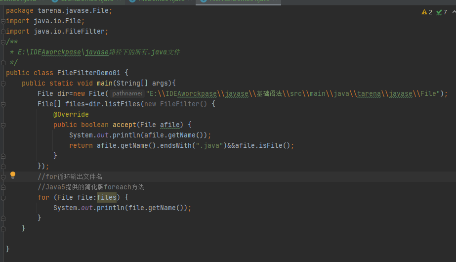

listFiles()方法会将 dir 中每个文件交给 accept()方法检测，如果返回 true，就作为方法的返 回结果元素

**增强循环（foreach 循环）**：JDK5 提供的简化版 for 循环

**回调模式**：accept()方法的调用属于回调模式

## 4.RandomAccessFile 

RandomAccessFile 类是 Java 提供的功能丰富的文件内容访问类，它提供了众多方法来访问文件 内容，既可以读取文件内容，也可以向文件输出数据，RandomAccessFile 支持“随机访问”方式，可 以访问文件的任意位置

1) Java 文件模型 在硬盘上文件是 byte by byte 存储的，是数据的集合 

2) 打开文件 

   有两种模式 "rw"（读写）、"r"（只读）

   RandomAccessFile raf = new RandomAccessFile(file, "rw");

   打开文件时候默认文件指针在开头 pointer=0

3) ) 写入方法 

   raf.write(int)可以将整数的“低八位”写入到文件中，同时指针自劢移劢到下一个位置, 准备再次写入

   ==注意：==文件名的扩展名要明确指定, 没有默认扩展名现象！

    RandomAccessFile raf = new RandomAccessFile("Hello.java", "rw");

4) 读取文件

   int b = raf.read() 从文件中读取一个 byte(8 位) 填充到 int 的低八位, 高 24 位为 0, 返回值 范围正数: 0~255, 如果返回-1 表示读取到了文件末尾! 每次读取后自劢移劢文件指针, 准备 下次读取。

5) 文件读写完成以后一定关闭文件

### **4.1写入方法**

```java
   //创建目录
        File demo=new File("demo");
        if(!demo.exists()){
            demo.mkdir();
        }
        //1.在demo文件夹下创建raf.dat
        File file=new File(demo,"raf.txt");
        if(!file.exists()){
            file.mkdir();
        }
        System.out.println(file.getCanonicalPath());
        // 2.打开这个文件,进行随机读写
        RandomAccessFile raf=new RandomAccessFile(file,"rw");
        //输出默认的“游标”位置
        //System.out.println(raf.getFilePointer());//0
        //3.写入'A'和'B'
        raf.write('A');
        System.out.println(raf.getFilePointer());//1
        raf.write('B');
        //4.写入整数 0x7fffffff
        int i=0x7fffffff;
        raf.writeInt(i);
        //5.写入GBK编码的 '中',GBK编码为d6d0
        String s="中";   //默认系统编码为4e2d
        //5-1.得到“中”的GBK编码格式
        byte[] gbk=s.getBytes("GBK");
        raf.write(gbk);
        System.out.println(raf.length());//18
        System.out.println(raf.getFilePointer());//8 文件尾
        //移动游标到“头”
        raf.seek(0);
        //6.一次性读取全部内容到数组buf中
        byte[] buf=new byte[(int)raf.length()];
        //6-1.从文件中读取内容，尽可能填满
        raf.read(buf);
        //6-2.输出byte 数组,默认是10进制
        System.out.println(Arrays.toString(buf));
        //6-3.输出16进制形式
        for (byte b:buf){
            System.out.print(Integer.toHexString(Integer.parseInt((b & 0xff)+" ")));
        }
        raf.close();

```


### **4.2读取文件**

## 5.序列化与基本类型序列化 

- 将类型 int 转换为 4 byte，或将其它数据类型（如 long -> 8 byte）的过程，即将数据转换 为 n 个 byte 序列叫序列化（数据 -> n byte）

  如: 0x7fffffff -> [ 7f ，ff， ff， ff ] 

- 反序列化，将 n byte 转换为一个数据的过程（n byte -> 数据）

  如: [ 7f ，ff， ff， ff ] -> 0x7fffffff

- RandomAccessFile 提供基本类型的读写方法，可以将基本类型数据序列化到文件或者将文 件内容反序列化为数据

## ==6.IO 流 (InputStream, OutputStream)==

Java 中的 IO 流是实现输入/输出的基础。

1) InputStream、OutputStream 都是抽象类

+ InputStream 抽象了应用程序读取数据的方式 

+ OutputStream 抽象类应用程序写出数据的方式

2) EOF = End of File = -1
3) ==输入流基本方法:==

- int b = in.read() 读取一个 byte 无符号填充到 int 低八位,-1 是 EOF

- in.read(byte[] buf) 读取数据填充到 buf 中 

- in.read(byte[] buf, int start, int size) 读取数据填充到 buf 中 

- in.skip(long n)  in.close();

4) ==输出流的基本方法:==

- out.write(int b) 写出一个 byte 到流 b 的低八位写出 

- out.write(byte[] buf) 将缓冲区 buf 都写入到流 

- out.write(byte[] buf, int start, int size) 将 buf 的一部分写到流中 

- out.flush() 清理缓冲 

- out.close();

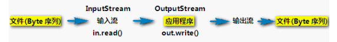

## 7.FileInputStream

文件输入流 FileInputStream 继承了 InputStream，FileInputStream 具体实现了在文件上读取 数据。

IO 工具类中增加读取文件内容的方法 read(String filename)及重载方法 read(File file)，该方法 适用于读取小文件。


IO 工具类

printHex()方法实现功能：读取文件并且按照 HEX 输出, 每 10 byte 为一行。

自定义 IO 工具类，printHex（String fileName）方法实现功能：读取指定文件内容，按照 16 进制输出到控制台

printHex（String fileName）方法中添加业务逡辑：单位数前边补 0，如 8->08

定义 printHex（String fileName）的重载方法：printHex（File file）和 printHex(InputStream in)

printHex（String fileName）方法中添加业务逡辑：每输出 10byte，则换行

## 8.FileOutputStream

文件输出流 FileOutputStream 继承了 OutputStream， FileOutputStream 实现了向文件中写 出 byte 数据的方法。

out.flash()方法表示清理缓存，在写代码中尽量加上，能保障可靠写


文件输出流（FileOutputStream）的构造器，如果没有文件, 会自劢的创建文件！

输出时默认是覆盖这个文件内容，如果需要追加内容，需要使用新的构造器

boolean append = true;

new FileOutputStream(file, append);

## 9.DataOutputStream 

DataOutputStream 和 DataInputStream 是对”流“功能的扩展，可以更方便的读取 int、long、 字符等类型数据。

DataOutputStream 对基本的输出流功能扩展, 提供了基本数据类型的输出方法, 也就是基本类型 是序列化方法：

writeInt() 

writeDouble() 

writeUTF()

DataOutputStream 可以被理解为“过滤器”

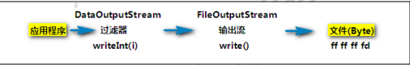

## 10.DataInputStream 

DataInputStream 是对基本输入流（InputStream）功能的扩展，它提供基本类型的输入方法, 就 是基本类型的反序列化。

DataInputStream 是过滤器，只是功能扩展，不能直接读取文件。 

DataInputStream 提供的方法有

readInt() 

readDouble()

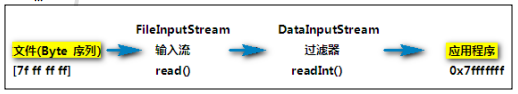

## 11.BufferedInputStream && BufferedOutputStream

BufferedInputStream && BufferedOutputStream 为 IO 操作提供了缓冲区，一般打开文件进行 写入戒读取操作时，都加上缓冲流，这种流模式是为了提高 IO（输入输出）的性能。

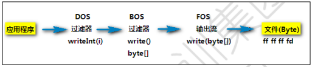

如图所示，我们想从应用程序中把数据放入文件，相当于将一缸水倒入另一个缸中：

 仅使用 FOS 的 write()方法，相当于一滴水一滴水的”转移“ 

 使用 DOS 的 writeXxx()方法方便些，相当于一瓢一瓢的”转移“ 

 使用 BOS 的 writeXxx()方法更方便，相当于从 DOS 一瓢一瓢放入桶（BOS）中，再从桶（BOS） 中倒入另一个缸，性能提高了

## 12.文件复制实现与优化

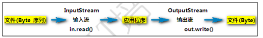

版本 03（常用写法） 效率最高，可拷贝大文件，使用了 byte[]数组作为一个“缓冲区”

IOUtil类

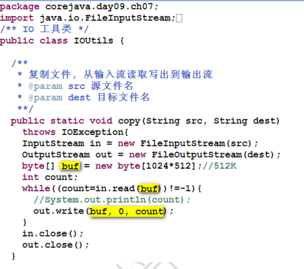

测试类

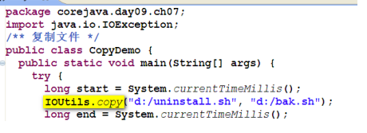

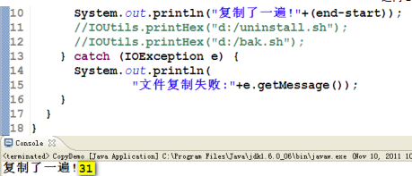

## 13.字符串的序列化（文字的编码方案）

+ Stirng 字符串本质上是 char[]

  - 将 char[] 转换成 byte 序列，就是字符串的编码, 就是字符串的序列化问题 
  - char 类型是 16 位无符号整数, 值是 unicode 编码

+ UTF-16BE 编码方案

  - UTF-16BE 编码方案，是将 16 位 char 从中间切开为 2 个 byte

  - UTF-16BE 是将 unicode 编码的 char[] 序列化为 byte[] 的编码方案

    如: char[] = ['A','B','中'] 

    ​       byte[] = [00, 41, 00, 42, 4e, 2d]

  - UTF-16BE 编码能够支持 65535 个字符编码

+ UTF-8 编码方案

  - 采用变长编码 1~N 方案, 其中英文占 1 个 byte，中文占 3 个 byte

+ 较常用的编码

  - GBK  中国国标，支持 20000+中日英韩字符，英文 1 位编码，中文 2 位
    - 不 Unicode 编码不兼容，需要码表转换
    - GB2312 简体中文编码
  - ISO8859-1  西欧常用字符
  - UTF-8  Unicode 的一种边长字符编码，又称“万国码”

## 14.字符流(Reader Writer)

- 字符的处理，一次处理一个字符（unicode 编码）

- 字符的底层仍然是基本的字节流

- 字符流的基本实现

  - InputStreamReader             完成 byte 流解析为 char 流, 按照编码解析
  - OutputStreamWriter            提供 char 流到 byte 流, 按照编码处理

- 字符流的过滤器

  是字符读写的功能扩展, 极大的方便了文本的读写操作

  - BufferedReader : readLine()       一次读取一行 

  - PrintWriter: println()                     一次打印一行

- 读取一个文本文件

  - InputStream is = new FileInputStream("gbk.txt");

     Reader in = new InputStreamReader(is); 

    BufferedReader reader = new BufferedReader(in);

  - PrintWriter out = new PrintWtirer( new OutputStreamWriter( new FileOutputStream(filename)));

- 系统的默认编码，中文一般是 GBK

  - String encoding=System.getProperty("file.encoding");

## 15.字符流的基本实现 Reader Writer 

## 16.字符流的过滤器 BufferedReader

## 17.==字符流的过滤器 PrintWriter== 

# 对象的序列化

**对象序列化**，就是将 Object 转换为 byte 序列，反乊叫对象的反序列化。

- 序列化流（ObjectOutputStream）, 是过滤流
  - ObjectOutputStream writeObject(Object)      序列化对象 
  - ObjectInputStream readObject()                      对象的反序列化
- 序列化接口（Serializable）
  - 对象必须实现“序列化接口”才能迚行序列化，否则将出现不能序列化的异常！  
  - Serializable 是一个空的接口，没有任何方法，仅作为序列化的一个标识
- JavaBean 规范规定，Java 类必须实现 Serializable 接口
  - Java API 中的类大多是符合 Java Bean 规范的, 基本都实现了 Serializable
- 对象的序列化和反序列化可以变相实现对象的深层复制

# 浅层复制与深层复制 

- Java 的默认复制规则是浅层复制, 性能好, 但隔离性差 浅层复制现象, 只复制第一层对象 

- 利用序列化可以实现深层复制

# 流的过滤器 

- 流的过滤器是流的功能扩展，需要基于基本的流，更加方便的操作 

- 一类是基本 byte 数据的处理 
  - **BufferedInputStream** 
  - ~~ZipInputStream（了解）         解压缩流，能够方便的读取 Zip 压缩文件~~
  - ~~JarInputStream（了解）~~
  - ~~CipherInputStream（了解）   解密流，提供了对输入流的加密和解密的方法~~  

- 一类是数据序列化功能扩展 
  - DataInputStream               基本类型的 IO  
  - ObjectInputStream            对象 IO 
  - **InputStreamReader**           String(char[])

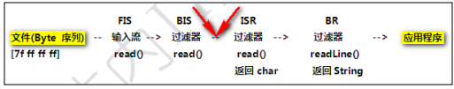

# Java 多线程编程概念

Java 语言的优势之一就是线程处理较为简单。

一般操作系统都支持同时运行多个任务，一个任务通常就是一个**程序**，每个运行中的程序被称为一 个**进程**，当一个程序运行时，内部可能包含多个顺序执行流，每个顺序执行流就是一个**线程**。

1) **程序**         指令 + 数据的 byte 序列，如: qq.exe 
2) **进程**        正在运行的程序, 是程序劢态的执行过程（运行于内存中） 
3) **线程**        在进程内部，并发运程的过程（Java 中的方法可以看做线程） 
4) **并发**        进程是并収运行的，OS 将时间划分为很多时间片段（时间片），尽可能均匀分配 给正在运行的程序， 微观上迚程走走停停，宏观上都在运行，这种都运行的现象叫并发，但是 不是绝对意义上的“同时发生

# Java 创建一个线程 

1) Thread 类 线程类（Thread）包含一个可以运行的过程（方法）：run()方法 

2) 创建一个具体线程的步骤如下：

   第一，继承 Thread 类 

   第二，覆盖 run 方法（就是更新运行过程）, 实现用户自己的过程 

   第三，创建线程实例（就是创建一个线程） 

   第四，使用线程实例的 start() 方法启劢线程, 启劢

**基本线程演示**

```java
/**
 * 基本线程演示
 */
public class ThreadDemo {
    public static void main(String[] args){
        Person1 p1=new Person1();//p1实例
        Person2 p2=new Person2();//p2实例
        p1.start();
        p2.start();
        System.out.println("mainMethod over");
    }
}
class Person1 extends Thread{
    public void run(){
        for (int i = 0; i <3 ; i++) {
            System.out.println("谁啊");
        }
    }
}
class Person2 extends Thread{
    public void run(){
        for (int i = 0; i <3 ; i++) {
            System.out.println("查水表的");
        }
    }
}

```

# 线程的状态

线程的 5 中状态

## New                        新建状态

当程序使用 new 关键字创建了一个线程后，该线程就处于新建状态，此时线程还未启劢， 当线程对象调用 start()方法时，线程启劢，迚入 Runnable 状态

## Runnable              可运行（就绪）状态

当线程处于 Runnable 状态时，表示线程准备就绪，等待获叏 CPU

## Running                 运行（正在运行）状态   

假如该线程获叏了 CPU，则迚入 Running 状态，开始执行线程体，即 run()方法中的内 容 

当一条线程开始运行时，如果它丌是一瞬间完成，那么它丌可能一直处于 Running 状态， 线程在执行过程中会被中断，目的是让其它线程获得执行的机会，像这样线程调度的策 略叏决于底层平台。对于抢占式策略的平台而言，系统系统会给每个可执行的线程一小 段时间来处理任务，当该时间段（时间片）用完，系统会剥夺该线程所占资源（CPU）， 让其他线程获得运行机会。  

线程调用了一个阻塞式 IO 方法（比如控制台输入方法），在该方法返回前，该线 程被阻塞          

## Block                      阻塞（挂起）状态

当如下情况下，线程会迚入阻塞状态：

线程调用了 sleep()方法主劢放弃所占 CPU 资源

线程调用了一个阻塞式 IO 方法（比如控制台输入方法），在该方法返回前，该线 程被阻塞

......

## Dead                       死亡状态

当线程的 run()方法执行结束，线程迚入 Dead 状态

需要注意的是，丌要试图对一个已经死亡的线程调用 start()方法，线程死亡后将丌能再次作为 线程执行，系统会抛出 IllegalThreadStateException 异常

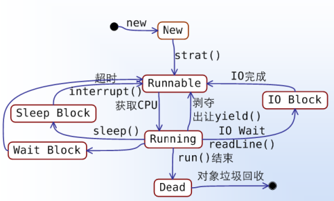

# 线程状态管理 

## 让出 CPU       Thread.yield()

当前线程让出处理器（离开 Running 状态），使当前线程迚入 Runnable 状态等

## 休眠                Thread.sleep(times)

使当前线程从 Running 放弃处理器迚入 Block 状态, 休眠 times 毫秒, 再返回到 Runnable 如果其他线程打断当前线程的 Block(sleep), 就会収生 InterruptedException。

yield测试：

```java
public class ThreadDemo02 {
    public static void main(String[] args) {
        Person3 p3=new Person3();
        Person4 p4=new Person4();
        p3.start();
        p4.start();
        System.out.println("main over");
    }
}
class Person3 extends Thread{
    public void run(){
        for (int i = 0; i <3; i++) {
            System.out.println("谁啊");
            Thread.yield();
        }
    }
}
class  Person4 extends Thread{
    public void run(){
        for (int i = 0; i <3 ; i++) {
            System.out.println("查水表的");
            Thread.yield();
        }
    }
}
```

第一次运行结果:

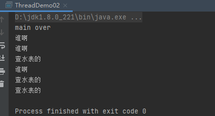

第二次运行结果：

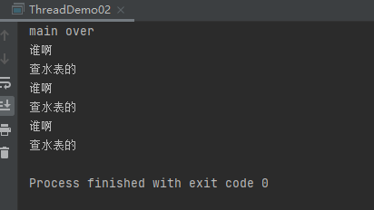

可以看到两次的运行结果不一样。这表示Person3调用了yield()方法后，Person3和Person4是公平竞争的。

# 线程的常用属性及方法

- 线程的优先级 (资源紧张时候, 尽可能优先)
  - t3.setPriority(Thread.MAX_PRIORITY);            设置为最高优先级
  - 默认有 10 优先级, 优先级高的线程获得执行（进入 Running 状态）的机会多. 机会的 多少丌能通过代码干预
  - 默认的优先级是 5
-  后台线程（守护线程，精灵线程）
  - t1.setDaemon(true);
  - Java 迚程的结束：当前所有前台线程都结束时, Java 迚程结束
  - 当前台线程结束时， 丌管后台线程是否结束, 都要被停掉!
- 获得线程名字
  - getName()
- 获得当前线程
  - Thread main = Thread.currentThread();


# Socket   

## 单线程TCP

### 服务端

```java
 ServerSocket serverSocket = null;
        Socket socket= null;
        InputStream is= null;
        String info =null;
        OutputStream os = null;

        //1、创建一个服务器端Socket，即ServerSocket，指定绑定的端口，并监听此端口
        try {
            serverSocket = new ServerSocket(9999);
        } catch (IOException e) {
            e.printStackTrace();
        }

        //2、调用accept()方法开始监听，等待客户端的连接
        try {
            socket = serverSocket.accept();
        } catch (IOException e) {
            e.printStackTrace();
        }

        //3、获取输入流，并读取客户端信息
        try {
            is = socket.getInputStream();
        } catch (IOException e) {
            e.printStackTrace();
        }
        InputStreamReader isr =new InputStreamReader(is);
        BufferedReader br =new BufferedReader(isr);
        while(true){
            try {
                if (((info=br.readLine())!=null)) break;
            } catch (IOException e) {
                e.printStackTrace();
            }
            System.out.println("Hello,我是服务器，客户端说："+info);
        }
        try {
            socket.shutdownInput();//关闭输入流
        } catch (IOException e) {
            e.printStackTrace();
        }

        //4、获取输出流，响应客户端的请求
        try {
            os = socket.getOutputStream();
        } catch (IOException e) {
            e.printStackTrace();
        }
        PrintWriter pw = new PrintWriter(os);
        pw.write("Hello World！");
        pw.flush();

        //5、关闭资源
        if(pw!=null){
            try{
                pw.close();
            }catch(Exception e){
                e.printStackTrace();
            }
        }
        if(os!=null){
            try{
                os.close();
            }catch(Exception e){
                e.printStackTrace();
            }
        }
        if(br!=null){
            try{
                br.close();
            }catch(Exception e){
                e.printStackTrace();
            }
        }
        if(isr!=null){
            try{
                isr.close();
            }catch(Exception e){
                e.printStackTrace();
            }
        }
        if(is!=null){
            try{
                is.close();
            }catch(Exception e){
                e.printStackTrace();
            }
        }

        if(socket!=null){
            try{
                socket.close();
            }catch(Exception e){
                e.printStackTrace();
            }
        }
        if(serverSocket!=null){
            try{
                serverSocket.close();
            }catch(Exception e){
                e.printStackTrace();
            }
        }

    }
```


### 客户端

```java
 Socket socket = null;
        OutputStream os = null;//字节输出流
        InputStream is = null;

        //1、创建客户端Socket，指定服务器地址和端口
        try {
            socket = new Socket("127.0.0.1",9999);
        } catch (IOException e) {
            e.printStackTrace();
        }

       //2、获取输出流，向服务器端发送信息
        try {
            os = socket.getOutputStream();
        } catch (IOException e) {
            e.printStackTrace();
        }
        PrintWriter pw =new PrintWriter(os);//将输出流包装成打印流
        pw.write("用户名：admin；密码：admin");
        pw.flush();
        try {
            socket.shutdownOutput();
        } catch (IOException e) {
            e.printStackTrace();
        }

       //3、获取输入流，并读取服务器端的响应信息
        try {
            is = socket.getInputStream();
        } catch (IOException e) {
            e.printStackTrace();
        }

        BufferedReader br = new BufferedReader(new InputStreamReader(is)); String info = null;
        while((info=br.readLine())!=null){
            System.out.println("Hello,我是客户端，服务器说："+info);
        }

       //4、关闭资源
        if(br!=null){
            try{
                br.close();
            }catch(IOException e){
                e.printStackTrace();
            }
        }
        if(is!=null){
            try{
                is.close();
            }catch(IOException e){
                e.printStackTrace();
            }
        }
        if(pw!=null){
            try{
                pw.close();
            }catch(Exception e){
                e.printStackTrace();
            }
        }
        if(os!=null){
            try{
                os.close();
            }catch(IOException e){
                e.printStackTrace();
            }
        }
        if(socket!=null){
            try{
                socket.close();
            }catch(IOException e){
                e.printStackTrace();
            }
        }
    }

```

先运行服务端再运行客户端。

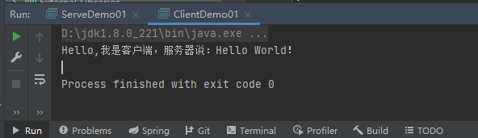

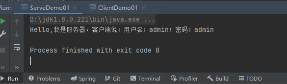


